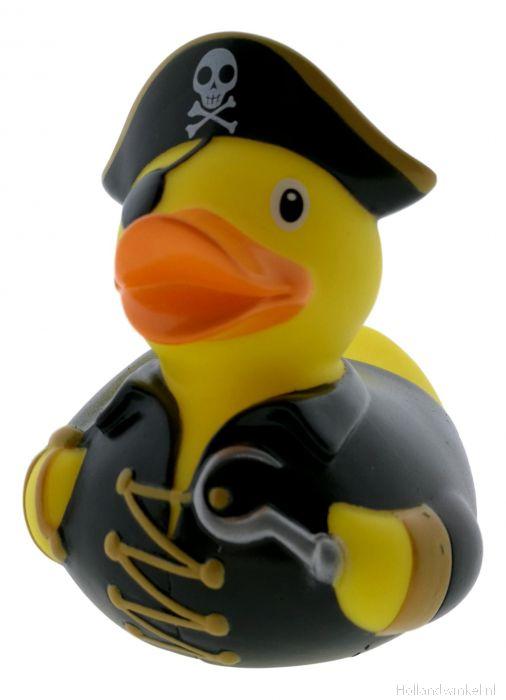

  

<h3 align="center">Pagina web para servicios</h3>

Si, he usado un template de ejemplo para hacer esto :3

## Descripción

Esta es mi pagina propuesta para usar en el proyecto de servidor web de servicios, he usado el siguiente template de boostrap https://getbootstrap.com/docs/4.0/examples/album/ y lo he modificado para que sea la pagina de un cine. No le he añadido más javascript que el que el paquete que viene por defecto con boostrap.

## Como probarlo

Para probar la pagina, simplemente hay que hacer un "git clone https://github.com/firex20/PaginaWebServicios" y ejecutar cualquier servidor web que queramos. En mi
caso estoy usando el servidor de php de testeo que hemos estado usando en clases de IAW.
Si quieres poder recompilarlo y ejecutarlo como dice en el proyecto original, tienes que seguir los siguientes pasos:

# Install dependencies
npm i

# Compile Sass
npm run css-compile

# Start server and watch Sass
npm start

### Bootstrap

En el proyecto base que he utilizado solo se incluye el contenido necesario para la pagina ya creada, en caso de necesitar más partes de bootstrap que no esten ya 
inlcuidas hay que ir a "scss/starter.scss" y descomentar las partes que se necesiten. Aunque quizas para esto haya que 

## Copyright

Para usar esta pagina debes ser fan del pato paco.

